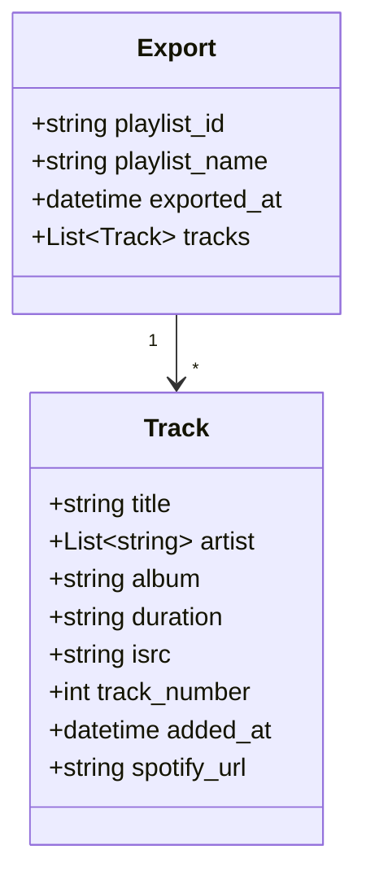
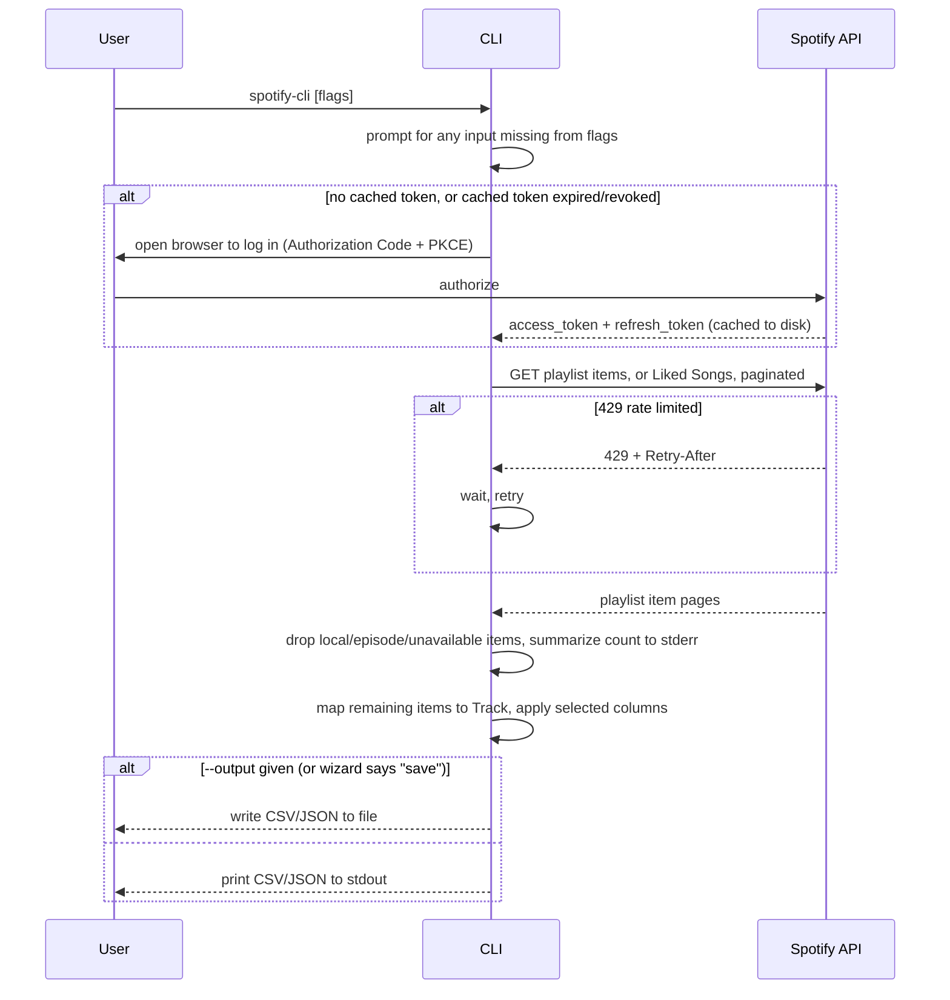

# Architecture

## Domain Model

`Track` isn't persisted — it exists only for the duration of one export, built from Spotify's playlist-items response, or from the Liked Songs (saved tracks) response when `--liked` is used — the two have different raw shapes (`item` vs. `track`) but are normalized to the same shape before reaching `Track`. `artist` is the one field with a shape that differs by target: a real list on the `Track` object (kept as an array in JSON), joined into a comma-separated string wherever a flat format is needed (CSV, the interactive column picker's display). Items Spotify reports as local files, podcast episodes, or unavailable/removed never become a `Track` — they're filtered out before this point, not represented with null fields. Liked Songs export uses the fixed `playlist_id`/`playlist_name` pair `"liked_songs"`/`"Liked Songs"`, since Spotify has no real playlist for it.

## Export Flow

The one flow the CLI has, whether triggered interactively or by flags, and whether the source is a playlist or (`--liked`) Liked Songs — those two only differ in which Spotify endpoint is paginated. Representative because it carries the two non-obvious rules: the 429 retry, and the silent-filter-with-summary for non-track items.

A 404 (playlist doesn't exist), 401 (bad/expired token), or 403 (playlist exists but isn't owned by, or shared with, the logged-in user — Spotify's API withholds track data from everyone else, regardless of the playlist's public/private visibility) never retries — the CLI fails fast with a clear message and exit code 1, unlike the 429 case above. The 429 retry (handled by `spotipy`) gives up after 5 attempts, to avoid hanging indefinitely on a persistent rate limit.
