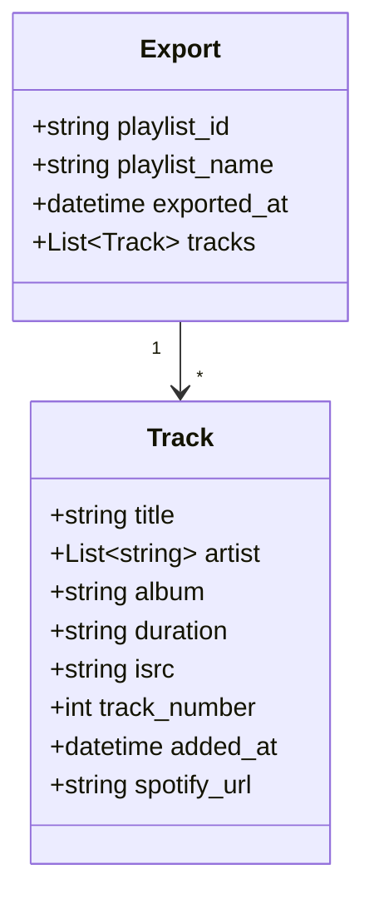
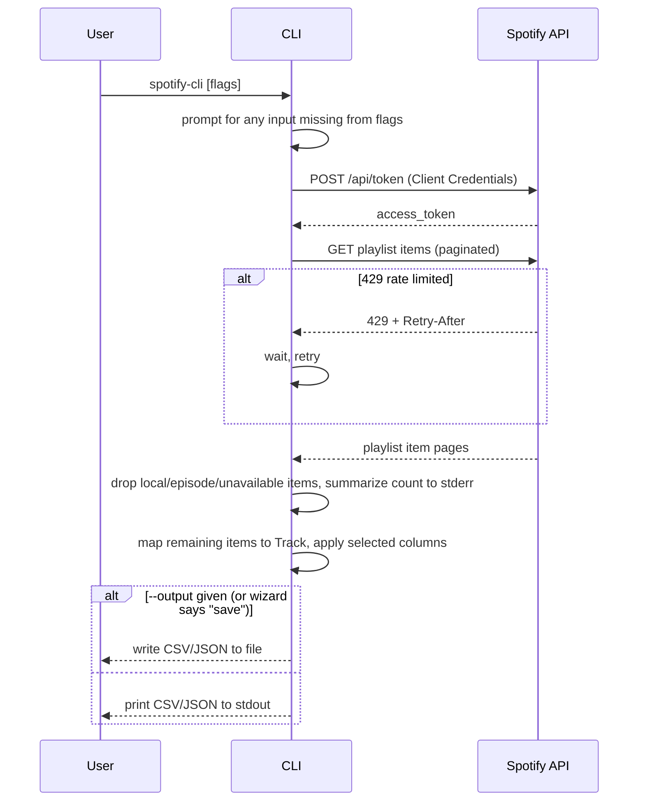

# Architecture

## Domain Model

`Track` isn't persisted — it exists only for the duration of one export, built from Spotify's playlist-items response. `artist` is the one field with a shape that differs by target: a real list on the `Track` object (kept as an array in JSON), joined into a comma-separated string wherever a flat format is needed (CSV, the interactive column picker's display). Items Spotify reports as local files, podcast episodes, or unavailable/removed never become a `Track` — they're filtered out before this point, not represented with null fields.

## Export Flow

The one flow the CLI has, whether triggered interactively or by flags. Representative because it carries the two non-obvious rules: the 429 retry, and the silent-filter-with-summary for non-track items.

A 404 (playlist not found/private) or 401 (bad credentials) never retries — the CLI fails fast with a clear message and exit code 1, unlike the 429 case above. The 429 retry gives up after 5 attempts, to avoid hanging indefinitely on a persistent rate limit.
